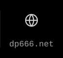
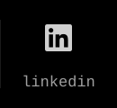

<a href="https://dp666.net/"><picture><source media="(max-width: 767px)" srcset="assets/card-mobile.svg"></picture></a>

<a href="https://dp666.net/blog/"><picture><source media="(max-width: 767px)" srcset="assets/links/mobile/blog.svg"></picture></a><a href="https://dp666.net/"><picture><source media="(max-width: 767px)" srcset="assets/links/mobile/web.svg"></picture></a><a href="https://mvp.microsoft.com/en-US/MVP/profile/95b1408f-1550-4bac-921e-caeb3b5edc2f"><picture><source media="(max-width: 767px)" srcset="assets/links/mobile/mvp-diamond.svg"></picture></a><a href="https://www.linkedin.com/in/danielpetri666"><picture><source media="(max-width: 767px)" srcset="assets/links/mobile/linkedin.svg"></picture></a><a href="https://x.com/danielpetri666"><picture><source media="(max-width: 767px)" srcset="assets/links/mobile/x.svg"></picture></a><a href="https://bsky.app/profile/danielpetri666.bsky.social"><picture><source media="(max-width: 767px)" srcset="assets/links/mobile/bluesky.svg"></picture></a><a href="mailto:d.petri@outlook.com"><picture><source media="(max-width: 767px)" srcset="assets/links/mobile/mail.svg"></picture></a>
